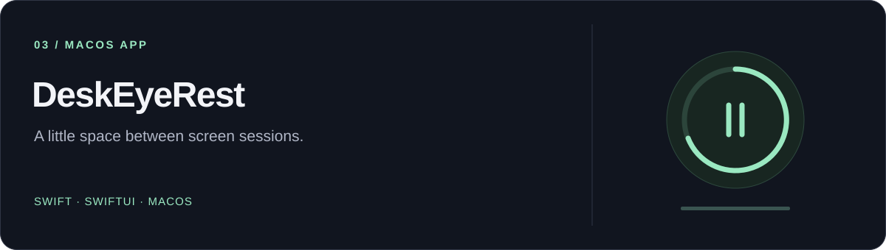

# DeskEyeRest

Приложение в строке меню macOS: помогает планировать перерывы от экрана и чередовать работу с отдыхом. Работает локально, написано на SwiftUI для macOS 14 и новее.

Мой pet-проект для повседневного использования и изучения Swift и SwiftUI. Основное направление моей работы — фронтенд; здесь пробую разработку нативных приложений.

[Возможности](#возможности) · [Сборка](#сборка-из-исходников) · [Приватность](#приватность) · [Разработка](#разработка)

**Swift · SwiftUI · macOS 14+**

## Возможности

- Настраиваемые циклы коротких и длинных перерывов.
- Полноэкранные напоминания о перерыве и завершении рабочего дня, короткие напоминания-вспышки.
- Рабочее расписание, уведомления, запуск при входе в систему и глобальные горячие клавиши.
- Локальная история перерывов и редактируемые подсказки с упражнениями.
- Опциональная приостановка таймера по времени бездействия, использованию аудиовхода и состоянию режима «Фокусирование» macOS — если доступ к этому состоянию уже разрешён.

## Приватность

Настройки хранятся в `UserDefaults`, история перерывов и пользовательские упражнения — в каталоге `Application Support` текущего пользователя. В исходном коде приложения нет сетевого клиента или телеметрии.

Для определения возможной встречи приложение проверяет, используется ли устройство аудиовхода. Звук при этом не захватывается и не записывается. Проверка режима «Фокусирование» читает только его текущее логическое состояние и только при уже выданном разрешении macOS.

## Текущее ограничение

Настройка определения активного видео оставлена для будущей реализации. Сейчас соответствующая проверка всегда сообщает, что активного видео нет, и не приостанавливает таймер.

## Требования

- macOS 14 или новее.
- Xcode с Command Line Tools.
- [XcodeGen](https://github.com/yonaskolb/XcodeGen).

## Сборка из исходников

В корне репозитория выполните:

```sh
xcodegen generate
open DeskEyeRest.xcodeproj
```

В Xcode выберите схему `DeskEyeRest`, устройство `My Mac` и запустите приложение. Сгенерированный `.xcodeproj` намеренно не хранится в Git: конфигурация проекта задаётся в `project.yml`.

## Структура проекта

```text
DeskEyeRest/
├── DeskEyeRest/          Состояние, таймеры, детекторы, хранение данных, UI и ресурсы
├── DeskEyeRestTests/     Модульные тесты
├── project.yml          Конфигурация XcodeGen
├── build.sh             Вспомогательный скрипт локальной сборки
└── THIRD_PARTY_NOTICES.md
```

## Разработка

- Исходники находятся в `DeskEyeRest/`. После изменения структуры проекта повторите `xcodegen generate`.
- После генерации проекта запустите тесты: `xcodebuild test -scheme DeskEyeRest`.
- Сведения об используемых шрифтах: [`THIRD_PARTY_NOTICES.md`](THIRD_PARTY_NOTICES.md) (на английском).
