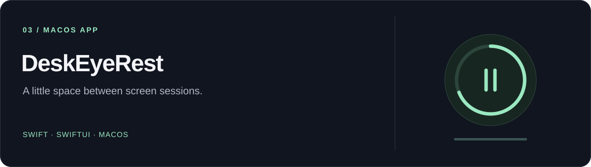

# DeskEyeRest

**English** | [Русский](README.ru.md)

A macOS menu bar app that helps you plan screen breaks and alternate work with rest. It runs locally and is written in SwiftUI for macOS 14 and newer.

**[Download for macOS](https://github.com/Zireael-web/desk-eye-rest/releases/latest)** (Apple Silicon, macOS 14+)

A personal side project for everyday use and for learning Swift and SwiftUI. My main field is frontend development; here I try building native apps.

[Features](#features) · [Build](#build-from-source) · [Privacy](#privacy) · [Development](#development)

**Swift · SwiftUI · macOS 14+**

## Features

- Configurable cycles of short and long breaks.
- Full-screen break and end-of-workday reminders, plus short flash reminders.
- Working hours, notifications, launch at login and global hotkeys.
- Local break history and editable exercise tips.
- Optional timer pause based on idle time, audio input use and the macOS Focus state — when access to that state has already been granted.

## Privacy

Settings are stored in `UserDefaults`; break history and custom exercises live in the current user's `Application Support` folder. The app's source code has no network client and no telemetry.

To detect a likely meeting, the app checks whether an audio input device is in use. No sound is captured or recorded. The Focus check reads only its current on/off state, and only when macOS permission has already been granted.

## Current limitation

Detection of active video is left for a future implementation. For now the check always reports that no video is playing and never pauses the timer.

## Requirements

- macOS 14 or newer.
- Xcode with Command Line Tools.
- [XcodeGen](https://github.com/yonaskolb/XcodeGen).

## Build from source

From the repository root:

```sh
xcodegen generate
open DeskEyeRest.xcodeproj
```

In Xcode, choose the `DeskEyeRest` scheme and the `My Mac` destination, then run the app. The generated `.xcodeproj` is intentionally not stored in Git: the project configuration lives in `project.yml`.

## Project structure

```text
DeskEyeRest/
├── DeskEyeRest/          State, timers, detectors, storage, UI and resources
├── DeskEyeRestTests/     Unit tests
├── project.yml          XcodeGen configuration
├── build.sh             Helper script for local builds
└── THIRD_PARTY_NOTICES.md
```

## Development

- Sources live in `DeskEyeRest/`. After changing the project structure, run `xcodegen generate` again.
- After generating the project, run the tests: `xcodebuild test -scheme DeskEyeRest`.
- Details about the bundled fonts: [`THIRD_PARTY_NOTICES.md`](THIRD_PARTY_NOTICES.md).

## License

The code is released under the [MIT License](LICENSE). Bundled fonts are distributed under the SIL Open Font License — see [`THIRD_PARTY_NOTICES.md`](THIRD_PARTY_NOTICES.md).
